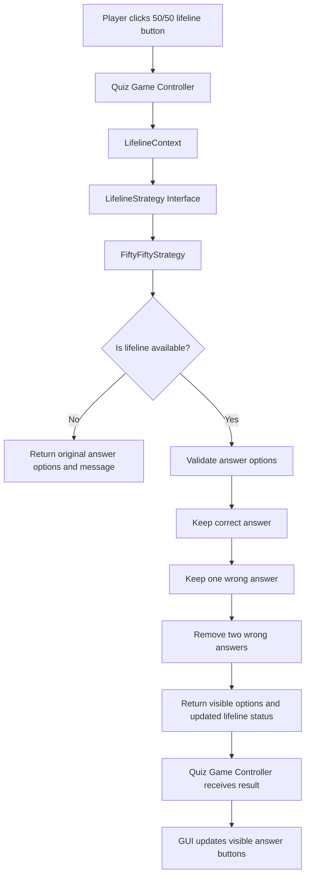

# Flow: 50/50 Lifeline With Strategy Pattern

## Purpose

This diagram shows how the 50/50 lifeline feature works in the Millionaire Quiz project after applying the Strategy Pattern.

The lifeline logic is separated into a dedicated module. This helps keep the quiz code clean, modular, and easier to extend.

## Mermaid Diagram

## Logic Description

The player activates the 50/50 lifeline from the quiz interface.

The quiz controller sends the current answer options, the correct answer, and the lifeline status to the lifelines module.

The `LifelineContext` uses the selected strategy. In this case, the selected strategy is `FiftyFiftyStrategy`.

The strategy checks whether the lifeline is still available. If it has already been used, the original answer options are returned with a message.

If the lifeline is available, the strategy keeps the correct answer and one wrong answer. Two other wrong answers are removed.

The result is returned to the quiz controller. The GUI can then update the visible answer buttons.

## Design Pattern

This feature uses the Strategy Pattern.

The Strategy Pattern was selected because more lifelines can be added in the future without changing the main quiz logic.
