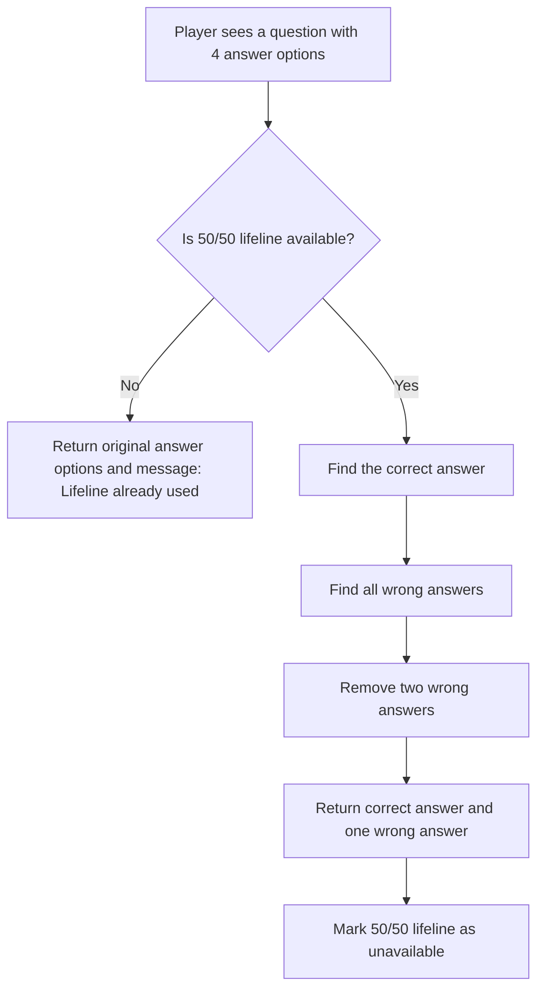

# Flow: 50/50 Lifeline

## Purpose

This diagram shows the logic of the 50/50 lifeline feature in the Millionaire Quiz project.

## Mermaid Diagram

## Logic Description

The player can use the 50/50 lifeline only once during the game.

If the lifeline has already been used, the function should return the original answer options and a message that the lifeline is not available.

If the lifeline is available, the function should keep the correct answer and one wrong answer. Two other wrong answers should be removed.

The logic should be implemented as a pure function. It should not directly update the GUI, database, files, or global variables.
